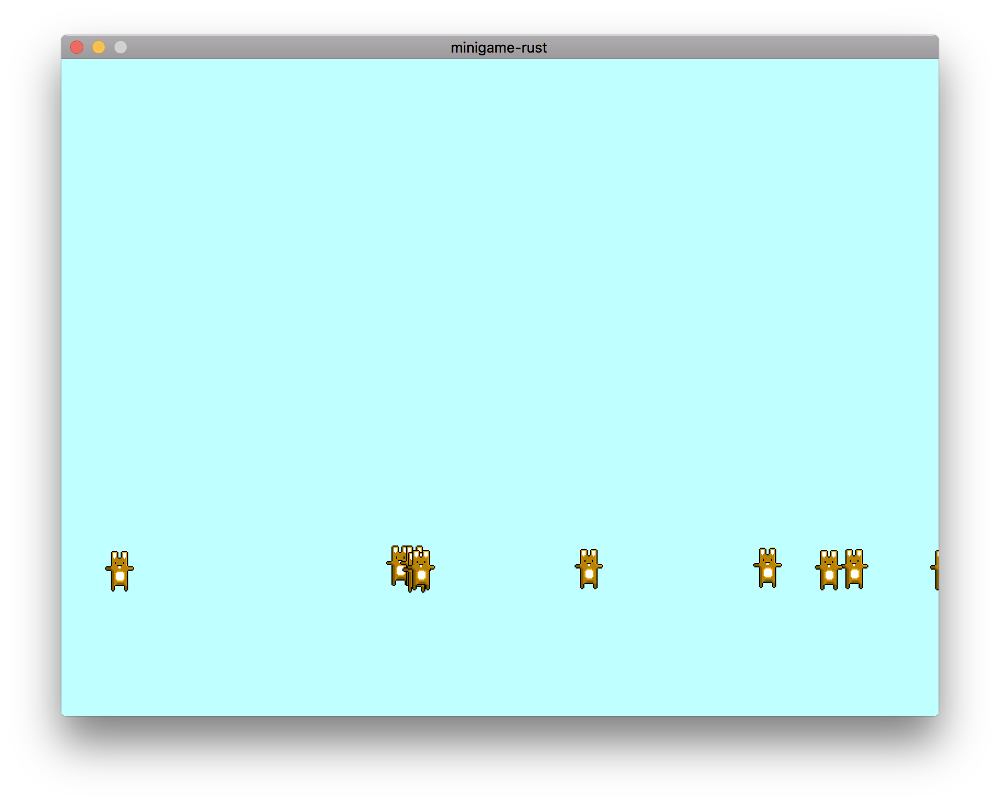

# minigame

This is a basic sample game made with Rust that runs on both desktop and mobile platforms.
Right now it's been tested on macOS, iOS and Android and it works as long as you do some steps by hand.
The idea is to have the whole show running on its own without the need of any manual step.

## Screenshot



## Hot code reloading

This is a feature that is only available on desktop but it's very handy when working with gameplay code.

Edit `src/test_shared.rs` and run `cargo build` to see hot reloading in action.

Run `cargo run` to run with the dynamic library
Run `cargo run --no-default-features` to run the application with all of the code statically linked and with hotloading disabled.

## Installing needed targets for mobile

```sh
# iOS. Note: you need *all* five targets
rustup target add aarch64-apple-ios armv7-apple-ios armv7s-apple-ios x86_64-apple-ios i386-apple-ios

# Android
rustup target add aarch64-linux-android armv7-linux-androideabi i686-linux-android x86_64-linux-android
```

## Building without hot reloading

```sh
cargo build --no-default-features --lib
```

## Building the Rust library for iOS

minigame supports building for both the iOS simulator and real devices.

### Building for the iOS simulator

To build for iOS simulator:

```sh
cargo build --no-default-features --target x86_64-apple-ios --lib
```

This command will also download SDL2 and compile it for both the simulator and iOS device

### Building for an iOS device

To build for iOS simulator:

```sh
cargo build --no-default-features --target aarch64-apple-ios --lib
```

This command will also download SDL2 and compile it for both the simulator and iOS device

## Compiling the iOS project

Just open the `ios/minigame/minigame.xcodeproj` Xcode project and run it and you should be done. 

## Building the Android standalone toolchain

```sh
/Users/tanis/Documents/android-sdk/ndk-bundle/build/tools/make_standalone_toolchain.py --arch arm --install-dir /Users/tanis/Documents/android-ndk-arm
/Users/tanis/Documents/android-sdk/ndk-bundle/build/tools/make_standalone_toolchain.py --arch arm64 --install-dir /Users/tanis/Documents/android-ndk-arm64
/Users/tanis/Documents/android-sdk/ndk-bundle/build/tools/make_standalone_toolchain.py --arch x86 --install-dir /Users/tanis/Documents/android-ndk-x86
/Users/tanis/Documents/android-sdk/ndk-bundle/build/tools/make_standalone_toolchain.py --arch x86_64 --install-dir /Users/tanis/Documents/android-ndk-x86_64
```

## Configuration for Android linking

For the time being you have to use a standalone toolchain. I'm pretty sure this can be solved with some clever
code in `build.rs` by setting the correct sysroot, but that's something left for later.

Edit `.cargo/config` and add the following:

```toml
[target.armv7-linux-androideabi]
linker = "/Users/tanis/Documents/android-ndk-arm/bin/arm-linux-androideabi-gcc"

[target.aarch64-linux-android]
linker = "/Users/tanis/Documents/android-ndk-arm64/bin/aarch64-linux-android-gcc"

[target.i686-linux-android]
linker = "/Users/tanis/Documents/android-ndk-x86/bin/i686-linux-android-gcc"

[target.x86_64-linux-android]
linker = "/Users/tanis/Documents/android-ndk-x86_64/bin/x86_64-linux-android-gcc"

```

## Building the SDL2 library for Android

```sh
cd android/Minigame/sdl
../gradlew assemble
```

## Building the Rust library for Android

The following used to work until I introduced dependent cargo libraries that wrap C/C++ code. It looks like `.cargo/config` parameters aren't being passed down the line, so we need a workaround.

```sh
cargo build --no-default-features --target armv7-linux-androideabi --lib
cargo build --no-default-features --target i686-linux-android --lib
cargo build --no-default-features --target x86_64-linux-android --lib
```

The workaround is to use the following and pass the reference to C, CXX and AR by hand (ugly!):

```sh
CC=/Users/tanis/Documents/android-ndk-arm/bin/arm-linux-androideabi-gcc CXX=/Users/tanis/Documents/android-ndk-arm/bin/arm-linux-androideabi-g++ AR=/Users/tanis/Documents/android-ndk-arm/bin/arm-linux-androideabi-ar cargo build --no-default-features --target armv7-linux-androideabi --lib

CC=/Users/tanis/Documents/android-ndk-x86/bin/i686-linux-android-gcc CXX=/Users/tanis/Documents/android-ndk-x86/bin/i686-linux-android-g++ AR=/Users/tanis/Documents/android-ndk-x86/bin/i686-linux-android-ar cargo build --no-default-features --target i686-linux-android --lib

CC=/Users/tanis/Documents/android-ndk-x86_64/bin/x86_64-linux-android-gcc CXX=/Users/tanis/Documents/android-ndk-x86_64/bin/x86_64-linux-android-g++ AR=/Users/tanis/Documents/android-ndk-x86_64/bin/x86_64-linux-android-ar cargo build --no-default-features --target x86_64-linux-android --lib
```

## Copying the Rust library to the Android project

```sh
cp target/armv7-linux-androideabi/debug/libminigame.so android/Minigame/app/src/main/jniLibs/armeabi/
cp target/armv7-linux-androideabi/debug/libminigame.so android/Minigame/app/src/main/jniLibs/armeabi-v7a/
cp target/i686-linux-android/debug/libminigame.so android/Minigame/app/src/main/jniLibs/x86/
cp target/x86_64-linux-android/debug/libminigame.so android/Minigame/app/src/main/jniLibs/x86_64/
```

## Buiding the actual Android application

```sh
cd android/Minigame/app
../gradlew assemble
```
